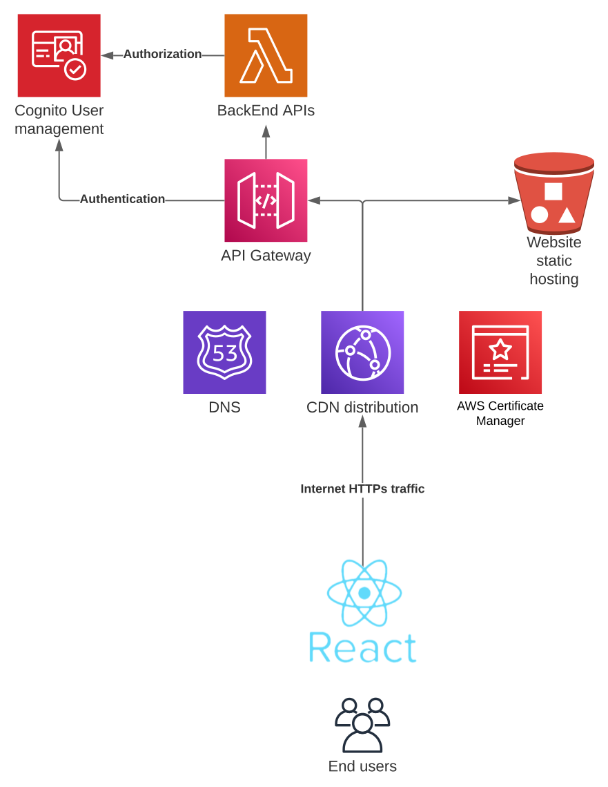
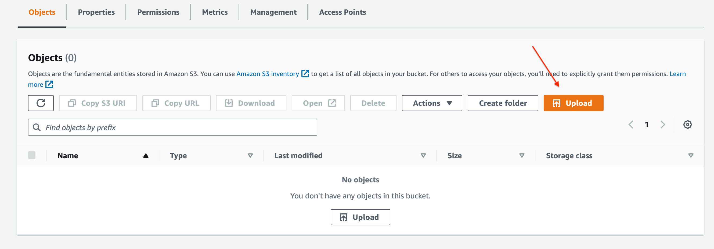
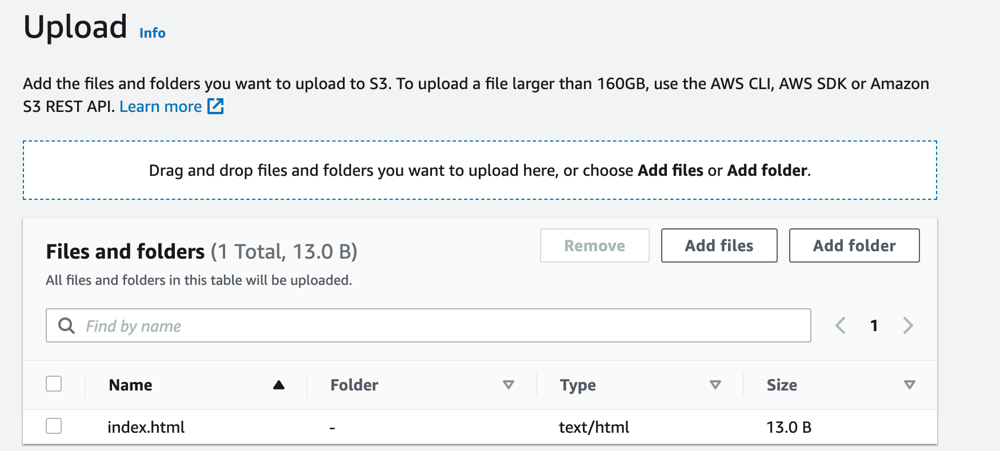
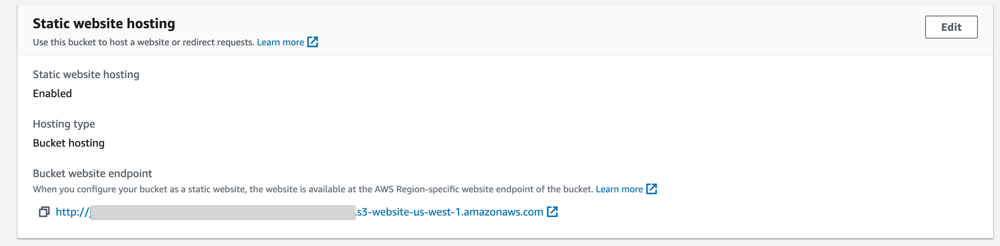
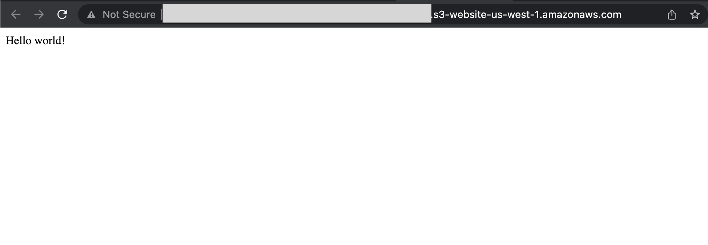

# Implementing and deploying a cloud native Full Stack application
## Part 1: Initializing and serving a Single Page Application (SPA)
### Introduction

Building an online presence is a key aspect of any business. In the past years, the industry has shifted from installable applications to web applications.
This shift has brought many benefits to both users and developers: users can now access applications from any device with a browser and developers can now focus on building the application instead of worrying about the infrastructure needed to host it.

Over the years, many strategies and technologies have been developed to make the development of web applications easier. In this series of articles we will be exploring one of them: an AWS cloud native Full Stack application using the following technologies:

* Front End:
   * Technology: client-side rendered React application using TypeScript
   * Hosting: AWS S3 + CloudFront + Route 53
* Back End:
   * Technology: serverless Node.js REST API
   * Hosting: AWS Lambda + API Gateway
* Authentication
   * Technology: AWS Cognito
   * AWS Managed
* Database
   * Technology: AWS DynamoDB
   * AWS Managed
* Infrastructure
   * Technology: AWS CDK using TypeScript

### Pre-requisites

This post assumes that you have Node and Yarn installed on your machine. If you don't have them installed, you can download them from [here](https://nodejs.org/en/download/) and [here](https://yarnpkg.com/getting-started). Node 18 will be used throughout this article.

AWS CDK will be used to deploy the application. If you don't have it installed, you can install it using the following command:

```bash
yarn global add aws-cdk
```

Throughout this article AWS resources will be created. In order to do so, an AWS account is also needed. If you don't have an AWS account, you can create one [here](https://aws.amazon.com/premiumsupport/knowledge-center/create-and-activate-aws-account/).
To get a better understanding of the costs associated with the resources that will be created, you can check the pricing of each service [here](https://aws.amazon.com/pricing/).

The AWS CLI will be used to interact with AWS. If you don't have it installed, you can install it following [this](https://docs.aws.amazon.com/cli/latest/userguide/getting-started-install.html) guide.

Once installed, it needs to be configured with the credentials of an AWS user that has the necessary permissions to create the resources that will be used in this article. If you don't have an AWS user with the necessary permissions, you can create one following [this](https://docs.aws.amazon.com/IAM/latest/UserGuide/id_users_create.html) guide.

The full code for this article can be found in its [repository](https://github.com/montevideolabs-org/blog-webapp).

### Chosen technologies
In order to solve the challenge at hand we will be using a set of technologies that are widely used in the industry. Here is a high level diagram of what will be developed:



The front end will be a [React](https://react.dev/) application hosted on AWS S3 and served using AWS CloudFront. React is a JavaScript library for building user interfaces maintained by Facebook and a large community of developers.
This library is built on top of the concept of components. Components are reusable pieces of code that can be used to build user interfaces. Once compiled, React applications are just a set of static files that can be served by any web server which makes it very easy to host on [AWS S3](https://aws.amazon.com/s3/).
S3 is a cloud storage service that can be used to store any kind of objects or files. It is a very cheap and reliable service that also provides the web-server functionality that we need.

The back end will be a [Node.js](https://nodejs.org/en/) REST API that will be hosted on [AWS Lambda](https://aws.amazon.com/lambda/) and served using [AWS API Gateway](https://aws.amazon.com/api-gateway/). Node.js is a JavaScript runtime environment that allows developers to run JavaScript code outside the browser.

Both the front and back end will be fronted by a [CloudFront](https://aws.amazon.com/cloudfront/) distribution. CloudFront is a content delivery network (CDN) layer that allows assets to be served from edge locations around the world. In this case, however, it will be used mostly to terminate SSL connections and (together with [Route 53](https://aws.amazon.com/route53/)) provide a custom domain name.

In order to secure the whole application, we will be using [AWS Cognito](https://aws.amazon.com/cognito/). AWS Cognito is a fully managed identity service that allows developers to add user sign-up, sign-in, and access control to web and mobile apps quickly and easily.

Finally, we will be using [AWS DynamoDB](https://aws.amazon.com/dynamodb/) as our database. DynamoDB is a fully managed NoSQL database service that provides fast and predictable performance with seamless scalability.


### Initializing the React application

To initialize the React application, we will use [Vite](https://vitejs.dev/). Vite is a fast build tool that provides a great developer experience.

Let's create a new directory for our project and initialize the React application using the following commands:

```bash
mkdir webapp
cd webapp

yarn create vite front-end --template react-ts
```

As suggested by the Vite CLI, we will now install the dependencies and start the development server:

```bash
cd front-end
yarn
yarn dev
```

If the installation was successful, you should see a message like the following:

```console
  yarn run v1.22.19
  $ vite

    VITE v4.3.5  ready in 987 ms

    ➜  Local:   http://localhost:5173/
    ➜  Network: use --host to expose
    ➜  press h to show help
```

You can now open your browser and navigate to http://localhost:5173/ to see the React application running.

### Initializing the CDK project

Now that we have our React application initialized, we will initialize the CDK project that will be used to deploy the application to AWS.
[AWS Cloud Development Kit (CDK)](https://aws.amazon.com/cdk/) is a framework that allows developers to define infrastructure using code. It supports multiple programming languages, but in this article we will be using TypeScript.

Let's go back to the root directory of our project and initialize the CDK project using the following commands:

```bash
cd ..
mkdir cdk
cd cdk
cdk init app --language typescript
```

This will create a new directory called `cdk` and initialize a CDK project inside it.

First thing you will need to do after initializing a project is bootstrapping it. This will create a bucket in your AWS account that will be used to store the assets that will be used by the CDK project. To do so, run the following command:

```bash
cdk bootstrap
```

Open the file `cdk/bin/cdk.ts` and rename the stack to your desire by changing the second parameter of the `CdkStack` constructor.

To deploy the stack, run the following command:

```bash
cdk deploy
```

This will deploy the stack to your default AWS account and region. If you want to deploy it to a different account or region, you can use the `--profile` and `--region` flags respectively.

### Hosting the application in AWS

As mentioned before, we will be using AWS S3 to host our compiled React application. We'll see, however, that S3 alone can help us to host our application, but it won't serve all our needs (more on this in the next sections). We will need to use CloudFront and Route53 to do so.

#### Creating the S3 bucket

In order to start creating resources, let's update our stack. Open the file `cdk/lib/cdk-stack.ts` and add the following code to the `CdkStack` class:

```typescript

import * as s3 from 'aws-cdk-lib/aws-s3';

export class CdkStack extends cdk.Stack {
  constructor(scope: cdk.Construct, id: string, props?: cdk.StackProps) {
    super(scope, id, props);

    const bucket = new s3.Bucket(this, 'website-bucket', {
      publicReadAccess: true,
      websiteIndexDocument: 'index.html',
      blockPublicAccess: new BlockPublicAccess({
        blockPublicAcls: false,
        blockPublicPolicy: false,
        ignorePublicAcls: false,
        restrictPublicBuckets: false

      })
    });
  }
}
```

Above code will create a bucket set up to have public access and to serve the file `index.html` when the root of the bucket is requested.

You can verify that by opening the AWS console and navigating to the S3 service. You should see a bucket named `website-bucket` in the list of buckets.
If you upload a valid HTML file named `index.html` to the bucket, you should be able to access it using the URL of the bucket (this one can be retrieved by checking the properties tab of the bucket, right at the end).




Navigating to the properties tab, right at the bottom.



You could even go the extra mile and attach a Route 53 domain, allowing you to serve your page within your favorite domain.

However, if you look closely in your browser, you might notice that it is warning you about the connection not being secure.
This is because the bucket is being served using HTTP instead of HTTPS.
This is not something that can be solved by the bucket itself (S3 website hosting only allows the use of HTTP), but it can be solved by using CloudFront.
As stated, CloudFront is a content delivery network (CDN) that can be used to serve content from different sources, including S3 buckets, EC2 instances or even other CDNs.
Besides caching, CloudFront also provides SSL termination, allowing us to serve our content using HTTPS.

#### Creating the CloudFront distribution

Let's go back to our stack and add the following code to the `CdkStack` class:

```typescript
// importing more stuff
import * as cloudfront from 'aws-cdk-lib/aws-cloudfront';
import * as origins from 'aws-cdk-lib/aws-cloudfront-origins';


// inside the CdkStack class
const distribution = new cloudfront.Distribution(this, 'website-distribution', {
  defaultBehavior: {
    origin: new origins.S3Origin(bucket),
    viewerProtocolPolicy: cloudfront.ViewerProtocolPolicy.REDIRECT_TO_HTTPS,
  },
  defaultRootObject: 'index.html',
});
```

Again, you can verify this by going to the AWS console and navigating to the CloudFront service. You should see a distribution named `website-distribution` in the list of distributions. The first property displayed should be its DNS name. If you open that URL in your browser, you should see the same page as before, but now served using HTTPS (don't worry, we'll add a human friendly URL to it later).

#### Deploying the application to S3

The only thing we need to do is to build the application and upload the static build files to the bucket.

Building the application is just a matter of running the following command:

```bash
cd front-end
yarn build
```

This will create a `dist` directory in the `front-end` directory containing all the files that need to be uploaded to the bucket.

To upload the files to the bucket, we will use the AWS CLI. To do so, run the following command:

```bash
aws s3 sync dist/ s3://<bucket-name>
```

You should be able to see the React application running by navigating to CloudFront's URL.

#### Adding a custom domain to the application

Now that we have our application running, we can add a custom domain to it. To do so, we will use Route 53. Route 53 is a DNS service that can be used to register domains and manage DNS records.

Registering a domain is outside the scope of this article, but you can find more information about it [here](https://docs.aws.amazon.com/Route53/latest/DeveloperGuide/domain-register.html).
This post assumes that you already have a domain registered and a [hosted zone](https://docs.aws.amazon.com/Route53/latest/DeveloperGuide/hosted-zones-working-with.html) configured to use it.

There are several steps required to accomplish this.
1. Update the bucket configuration to make it private and disable the webserver functionality
    ```typescript
    const bucket = new s3.Bucket(this, 'website-bucket', {
       encryption: s3.BucketEncryption.S3_MANAGED
    });
    ```
2. Get an instance of the hosted zone:
   ```typescript
   const hostedZone = route53.HostedZone.fromLookup(this, 'hosted-zone', {
      domainName: BASE_DOMAIN,
   });
   ```
   Hosted zones are region specific, so make sure to use the same region as the one where the domain is registered. To do this, uncomment the following line in `bin.cdk.ts` and make sure to have the environment variables setup.
   ```
   env: { account: process.env.CDK_DEFAULT_ACCOUNT, region: process.env.CDK_DEFAULT_REGION },
   ```
3. Generate a certificate for the domain:
   ```typescript
   import * as acm from 'aws-cdk-lib/aws-certificatemanager';

   const certificate = new acm.DnsValidatedCertificate(this, 'certificate', {
      domainName: BASE_DOMAIN,
      hostedZone: hostedZone,
      region: 'us-east-1',
   });
   ```
4. Update the distribution to use the domain name and the certificate
   ```typescript
   const distribution = new cloudfront.Distribution(this, 'website-distribution', {
      defaultBehavior: {
         origin: new origins.S3Origin(bucket),
         viewerProtocolPolicy: cloudfront.ViewerProtocolPolicy.REDIRECT_TO_HTTPS,
      },
      domainNames: [BASE_DOMAIN],
      defaultRootObject: 'index.html',
      certificate: certificate,
    });
   ```
5. Add a DNS record to the hosted zone to point to the distribution
   ```typescript
   import * as route53 from 'aws-cdk-lib/aws-route53';
   import * as route53Targets from 'aws-cdk-lib/aws-route53-targets';
   
   const DNSRecord = new route53.ARecord(this, 'DNSRecord', {
     zone: hostedZone,
     recordName: BASE_DOMAIN,
     target: route53.RecordTarget.fromAlias(new route53Targets.CloudFrontTarget(distribution)),
   })
   ```

After deploying the stack, you should be able to access the application using the domain name.

### Cleanup
If you ever wish to delete all the created resources, you can do so by running the following command:
```bash
cdk destroy
```

## Next steps

In the next article of this series we'll be adding back end logic to serve dynamic content, as well as authentication and persistence.
